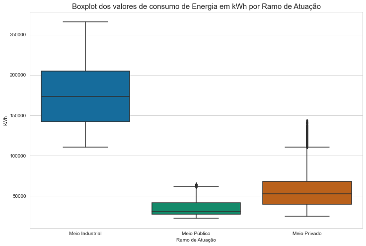
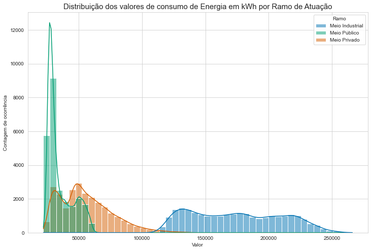
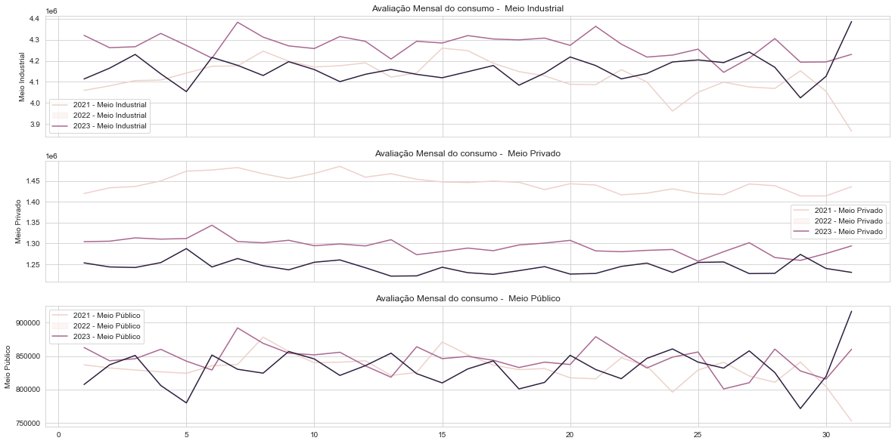
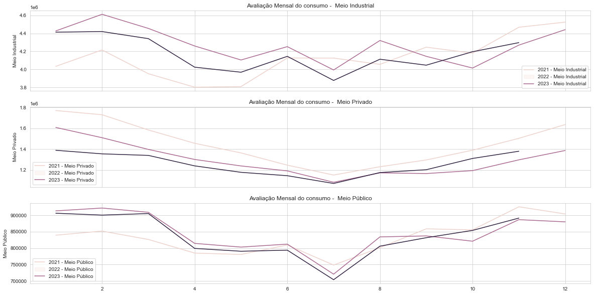
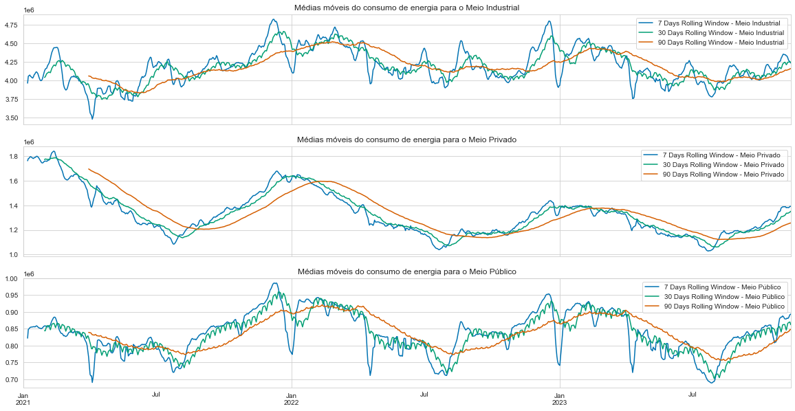
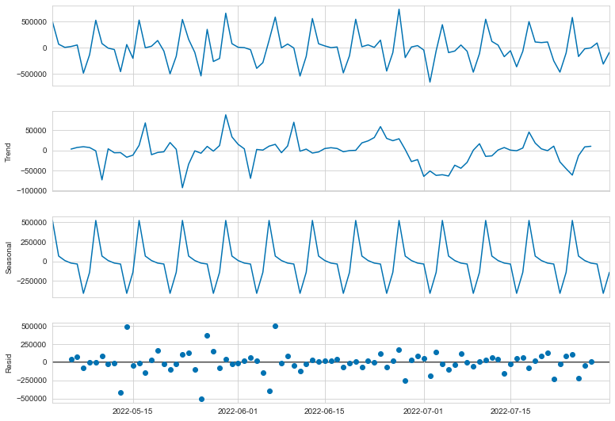
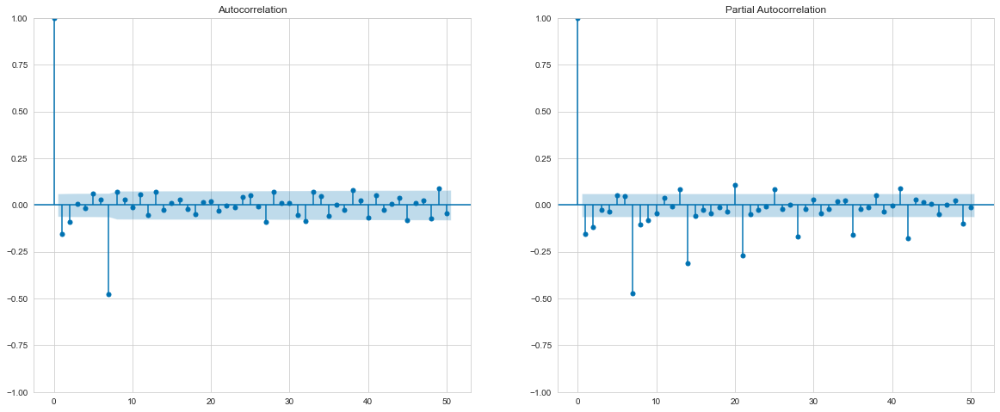
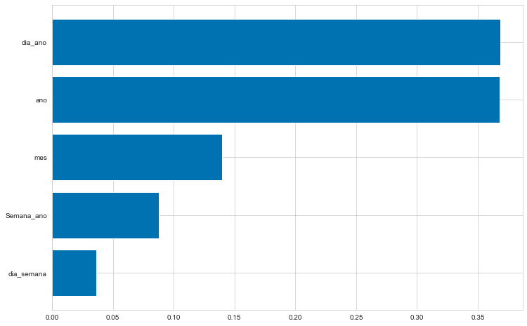
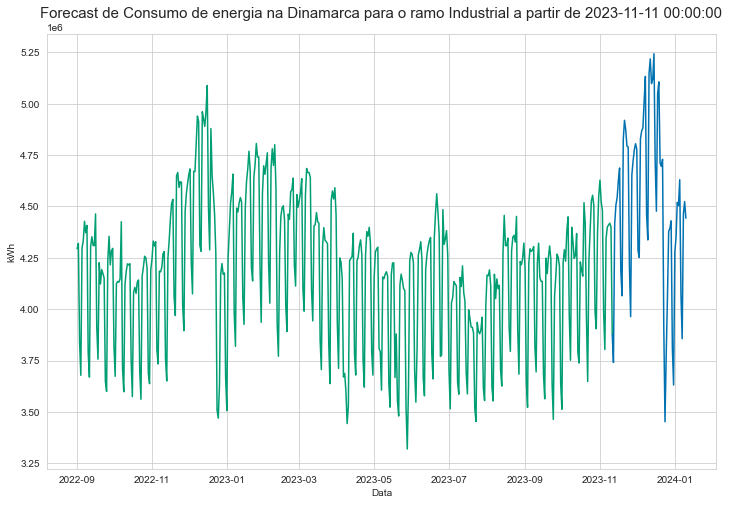

# ⚡ Forecast de Consumo de Energia - Copenhague, Dinamarca

## 📌 1. Visão Geral (Overview)
A energia é um dos mais fortes indicadores do desenvolvimento e potêncial econômico de um país. O gerenciamento inteligente da malha energética e a **previsão assertiva de demanda** capacita governos e empresas privadas a ajustarem sua produção de forma estratégica, otimizando a alocação de recursos, evitando desperdícios e inibindo a possibilidade de sobrecargas ou apagões na rede.

Este projeto representa uma solução **End-to-End** em predição de alta complexidade. Nele, aplicamos metodologias de **Análise Exploratória de Dados (EDA)**, **Processamento de Sinais/Séries Temporais** e **Machine Learning** estruturado, com o intuito de projetar e antever o volume diário de consumo de energia da cidade de Copenhague (Município de código 101, *København*), provando que é possível superar consideravelmente estimativas tradicionais de planejamento.

---

## 💼 2. Entendimento de Negócio e Coleta de Dados
Os dados foram extraídos remotamente através da [API Pública da Energinet (Dinamarca)](https://en.energinet.dk/energy-data/data-catalog/). A Energinet é responsável por manter a infraestrutura principal e a transmissão de eletricidade e gás do país.

O DataFrame primário possui granularidade em horas, cobrindo o fuso horário dinamarquês (`HourDK`), e divide o município em nichos/ramos principais (`Branche`): **Indústria (Erhverv)**, **Público (Offentligt)** e **Privado (Privat)**. 

### 2.1 Distribuição do Uso de Energia
A primeira etapa revelou realidades matemáticas distintas para cada um dos subsetores no uso de quilowatts-hora (`ConsumptionkWh`):

  

- **Indústria:** Possui uma variabilidade achatada, no entanto opera em montantes de energia absurdamente mais pesados.
- **Público:** Assimetria intensa, ancorado em consumos marginais (baixos).
- **Privado:** Distribuição assimétrica ("cauda longa" para a direita), com comportamentos cíclicos ao longo de dias úteis.

  

---

## 🔎 3. Análise Exploratória e Engenharia de Sazonalidades (EDA)

Ao longo dos testes visuais com o tempo, localizamos dependências claras tanto em escopo *diário* (horários de pico) quanto em *médio-prazo* (dias da semana, janelas mensais). 

### 3.1 Sazonalidade Diária e Semanal
As plotagens das horas do dia (para o meio **Privado**) demonstraram vales nas madrugadas e acentuados picos nas fases do amanhecer e de início de entardecer (comportamento humano de retorno ao domicílio e início do expediente). Para estabilização e precisão em estimativa futura, a **decisão de engenharia** foi o agrupamento resample (`.resample('D')`) dos dados, mudando a resolução de hora para a **soma diária de consumo**.

  

Ao avaliarmos o Boxplot agrupado pelos **dias da semana**, notamos algo esperado, mas imprescindível: a Indústria consome vastamente mais energia no "miolo" da semana, enquanto que seu consumo despenca drasticamente nos fins de semana (Sábado e Domingo), sendo inversamente proporcional ao meio Privado. 

### 3.2 O Comportamento de Longo Prazo (Médias Móveis vs Eventos Mensais)

  

Analisando a quebra mês a mês através de amostragens temporais ao longo dos anos, nota-se uma grave **diminuição do consumo no mês de Julho** em toda a capital de Copenhague. Esta anomalia sistêmica coincide com o verão europeu e os principais feriados dinamarqueses e recessos industriais.

Para purificar os ruídos normais da variação energética da medição, plotamos gráficos contendo médias móveis (*Rolling Means*):

  

*Nota: Através da curva vermelha suavizada para 90 dias, é nítido atestar que o consumo energético de Copenhague não apresenta forte tendência linear de subida (o que implicaria que a cidade cresce progressivamente seu consumo).*

---

## 📈 4. Predição via Modelos Clássicos Estatísticos (Box-Jenkins)

Para validar a qualidade da predição criamos a "Baseline". Em problemas de mercado real, a baseline frequentemente se resume a "prever que o amanhã será igual a média recente". Nosso baseline móvel de 7 dias acusou um Erro Percentual Absoluto (MAPE) de **~6.02%**.

### 4.1 Extraindo Estacionariedade e Decomposição
As séries temporárias para modelos como **ARIMA** exigem *Estacionariedade*. Aplicamos o Teste ADF (Augmented Dickey-Fuller) confirmando $p$-value instável ($> 0.05$). Dessa forma, executou-se a matriz de decaimento via **Diferenciação**, decompondo a série real em três faces limpas: *Tendência, Sazonalidade e Ruído Branco (Resíduos)*:

  

### 4.2 Auto-Correlações e Modelos SARIMA
Os correlogramas (ACF e PACF) mostraram não somente ecos em pequenos lags, mas uma correlação forte com o exato $Lag=7$ dos dados. Ou seja, como visto antes, *a próxima Segunda-Feira depende fortemente do que foi a Segunda-Feira passada.*

  

Montamos arquiteturas iterativas de busca de hiperparâmetros por AIC e BIC (via `pmdarima` e For Loops), sendo que o modelo **SARIMA (1,1,1)(0,1,2)[7]** emergiu superando a baseline com MAPE em torno de ~3.2%. No entanto, o `Prob(JB)` demostrou assimetrias e falhas na distribuição normal dos resíduos gerados indicando a limitação da correlação estritamente linear no processo temporal estendido.

  

---

## 🤖 5. Soluções Robustas em Aprendizado de Máquina (Machine Learning)

Enquanto a modelagem clássica assume que a relação entre o futuro e o passado é linearmente determinada, modelagens baseadas em árvores traçam sub-relações mais orgânicas. 

A abordagem técnica separou-se na **Engenharia de Duas Vertentes de Features**:
- **A. Features de Calendário Temporal:** Geração exaustiva do dia cronológico (`day`), semana do ano (`week`), ano em si (`year`), dia do ano cumulativo (`dayofyear`), permitindo que a árvore aprenda o comportamento físico das datas per se.
- **B. Features baseadas em "Lags":** Envia para as colunas do "Hoje" os exatos valores defasados dos últimos $n$ dias de medições de cada série de interesse temporal.

### 5.1 O Desempenho dos Algoritmos (Ridge, Random Forest e XGBoost)
Treinamos a amostragem em três vias. Diferente de regressões estáticas, Random Forests controlam não linearidades com alta tolerância à variação. Por outro turno, usamos as vantagens logarítmicas de gradiente descendente do **XGBoost Regressor**, que extrai de features fracas para unificar um regressor exponencialmente potente.

  

*Previsão simulada no conjunto C de Validação para o modelo de base XGBoost baseadas em calendários.*

### 5.2 Avaliando o Que Importa ("Feature Importance")
No melhor caso estruturado (XGBoost - Calendário Temporal), a árvore de gradiente não confiou cegamente somente no comportamento estrito do "Dia da Semana", mas revelou uma **monstruosa dependência** do `dayofyear` (fator direto sobre a qualificação do mês em si, evidenciando o fato que o período veraneio ou inverso importava vitalmente para a demanda, mais do que qualquer outro critério estrito).

  

---

## 🏆 6. Track de Performance com MLflow & Resultados Campeões

Implementamos a biblioteca oficial do **MLflow (Tracking e Models)**, mantendo estrito acompanhamento versão à versão de tudo o que foi provado, incluindo os salvamentos dos scores de perdas (`MAE`) e a plotagem interna e metadados vitais de cada tunning.

### 📈 Tabela Conclusiva de Comparativos de Testes Categóricos

| Modelo Aplicado / Tipo | MAE | MAPE (%) | Erro Relativo (Status) |
| :--- | :---: | :---: | :---: |
| **Baseline Média Móvel Lenta (7 dias)** | 241,342 | 6.02% | Referência Inicial |
| **SARIMA Auto / Clássico Arima** | 236,505 | 5.93% | Empate Prático |
| **SARIMA Tuned [com Lags Sazonais]** | 137,928 | 3.28% | - 45% do Erro |
| **Regressão Ridge via Lags** | 103,340 | 2.53% | Excelente |
| **Random Forest via Lags Sazonais** | 103,340 | 2.53% | Excelente |
| **XGBoost Tuned (Features de Data)* Vencedor** | 118,992 | **2.84%** | O Melhor Regressor Dinâmico |

A escolha de aplicação na **Produção Final (Unseen Data)** se deu pelo XGBoost (`MAPE ~ 3.3%` no TimeSeriesSplit cross-validated final), baseando-se no fato que este modelo detém alta adaptabilidade e dependência mais robusta e independente para previsão cega à distâncias mais distantes do dia 0 ($Target_{60}$).

---

## 🔮 7. Previsão da Produção - Estimando para os Próximos 60 Dias

Aplicou-se a varredura e retreinamento unificado da base total existente com o XGBoost sob hiperparâmetros refinados. Estendemos o calendário projetado de features artificais num gerador vazio do Pandas e o submetemos ao regressor, recuperando **um padrão verossímil altíssimo e comportamental em relação ao que estaria por vir na gestão energética de Copenhague nos cruciais 60 dias inexplorados**:

  

### 💡 Conclusão Financeira / Corporativa:
Uma queda brutal de erro predivito que salta de de **6% para o contorno de 3% num ciclo energético de bilhões de correntes térmicas**, traduz-se sem escrúpulos em uma economia formidável de logística, estoques emergenciais, compra e venda programada de energia entre municípios adjacências, bem como melhor governança para sustentabilidade de CO².

## 🔗 Próximos Incrementos (To-Do Extras)
- [ ] Otimização para Redes Residuais ou LSTMs voltadas para Séries Temporais em Deep Learning PyTorch.
- [ ] Construção robusta de Interface web em Streamlit visualizando os KPIs dos resíduos diários em Produção Online.
- [ ] Teste em malha integrada inter-cidades (Prever via Regressores Globais sobre toda a fronteira da Dinamarca simultaneamente).
- [ ] Dockerização e deploy em AWS EC2 / Sagemaker do backend preditivo rodando sobre um agendador diário cron/Airflow.
